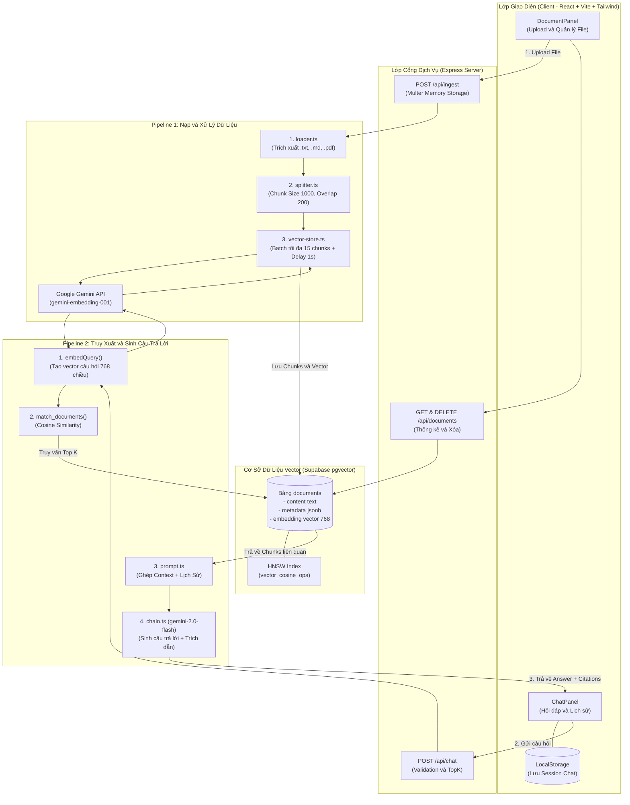
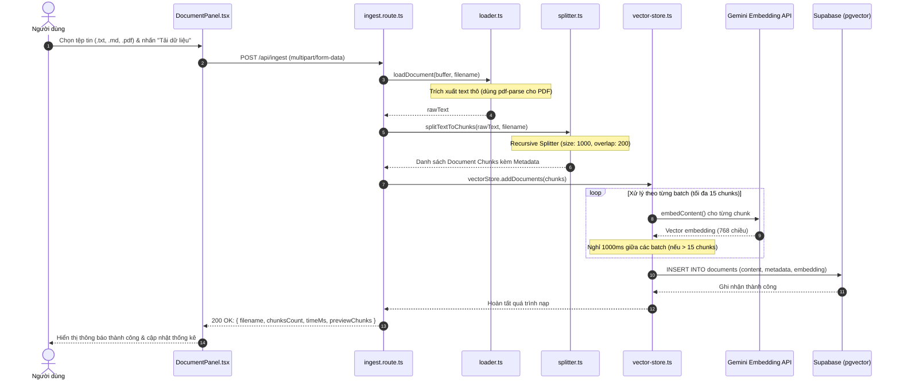
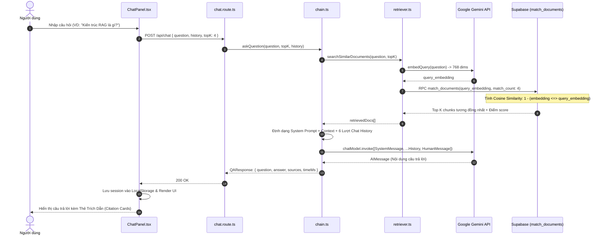
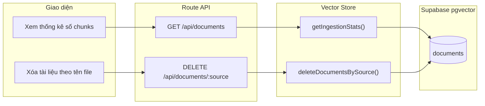

# Tài Liệu Workflow Dự Án: Minimal RAG Engine

Tài liệu mô tả chi tiết toàn bộ kiến trúc và luồng xử lý (workflow) của hệ thống **Minimal RAG Engine**, được xây dựng trên nền tảng **TypeScript**, **Express**, **LangChain**, **Google Gemini** và **Supabase pgvector**.

---

## 1. Kiến Trúc Tổng Thể & Luồng Dữ Liệu

---

## 2. Pipeline 1: Quy Trình Nạp Dữ Liệu (Ingestion Pipeline)

Quy trình nhận tệp tin thô từ người dùng, trích xuất nội dung, phân đoạn, sinh vector embeddings và lưu trữ vào pgvector.

### Các Bước Thực Hiện Chi Tiết

1. **Tiếp nhận Tệp (File Upload):**
   - Thành phần: [`client/src/components/DocumentPanel.tsx`](file:///C:/Users/ADMIN/Desktop/Week1/client/src/components/DocumentPanel.tsx)
   - Kiểm tra định dạng đầu vào (`.txt`, `.md`, `.pdf`), dung lượng tối đa 4.5MB.
   - Gửi yêu cầu HTTP POST `multipart/form-data` tới endpoint `/api/ingest`.

2. **Xử lý Tệp & Trích xuất Văn bản (Text Extraction):**
   - Thành phần: [`server/src/routes/ingest.route.ts`](file:///C:/Users/ADMIN/Desktop/Week1/server/src/routes/ingest.route.ts) và [`server/src/lib/rag/loader.ts`](file:///C:/Users/ADMIN/Desktop/Week1/server/src/lib/rag/loader.ts)
   - Multer nhận file vào bộ nhớ RAM (`memoryStorage`).
   - Với `.txt` / `.md`: Giải mã trực tiếp từ UTF-8 Buffer.
   - Với `.pdf`: Khởi tạo module `pdf-parse` để giải mã các trang PDF thành chuỗi văn bản sạch.

3. **Phân đoạn Văn bản (Text Splitting / Chunking):**
   - Thành phần: [`server/src/lib/rag/splitter.ts`](file:///C:/Users/ADMIN/Desktop/Week1/server/src/lib/rag/splitter.ts)
   - Sử dụng `RecursiveCharacterTextSplitter` từ `@langchain/textsplitters`.
   - `chunkSize = 1000`, `chunkOverlap = 200`.
   - Phân tách tuần tự ưu tiên theo đoạn (`\n\n`), dòng (`\n`), câu (`.`, `?`, `!`) rồi đến từ nhằm bảo tồn ngữ cảnh ngữ nghĩa.
   - Gắn metadata cho từng chunk: `{ source: filename, chunkIndex: number, createdAt: ISOString }`.

4. **Tạo Vector Nhúng (Embedding Generation) & Kiểm soát Tốc độ:**
   - Thành phần: [`server/src/lib/rag/vector-store.ts`](file:///C:/Users/ADMIN/Desktop/Week1/server/src/lib/rag/vector-store.ts)
   - Sử dụng mô hình `gemini-embedding-001` sinh vector 768 chiều.
   - Cơ chế bảo vệ Rate Limit: Nếu số chunks > 15, hệ thống tự động gom cụm tối đa 15 chunks / batch và delay 1000ms giữa các batch để tránh lỗi `429 Too Many Requests`.

5. **Lưu trữ vào Vector Database:**
   - Bảng cơ sở dữ liệu: `documents` trên Supabase pgvector.
   - Đánh chỉ mục HNSW (`vector_cosine_ops`) giúp tăng tốc độ tìm kiếm láng giềng gần nhất (ANN search).

---

## 3. Pipeline 2: Quy Trình Hỏi Đáp RAG (Q&A Retrieval & Generation Pipeline)

Quy trình tiếp nhận câu hỏi của người dùng, tìm kiếm các đoạn thông tin có ngữ nghĩa tương đồng nhất và gọi LLM để tổng hợp câu trả lời chính xác có dẫn nguồn.

### Các Bước Thực Hiện Chi Tiết

1. **Gửi Câu Hỏi & Lịch Sử:**
   - Thành phần: [`client/src/components/ChatPanel.tsx`](file:///C:/Users/ADMIN/Desktop/Week1/client/src/components/ChatPanel.tsx)
   - Client thu thập nội dung câu hỏi cùng các lượt hội thoại trước đó (loại trừ tin nhắn chào mặc định), gửi qua HTTP POST `/api/chat`.

2. **Tạo Vector Truy Vấn (Query Vector):**
   - Thành phần: [`server/src/lib/rag/retriever.ts`](file:///C:/Users/ADMIN/Desktop/Week1/server/src/lib/rag/retriever.ts)
   - Gọi `GeminiEmbeddings.embedQuery(question)` để chuyển đổi câu hỏi thành vector 768 chiều cùng không gian biểu diễn với các tài liệu đã nạp.

3. **Truy Vấn Tương Đồng Ngữ Nghĩa (Vector Similarity Search):**
   - Thành phần: Stored Procedure `match_documents` trong [`scripts/supabase-schema.sql`](file:///C:/Users/ADMIN/Desktop/Week1/scripts/supabase-schema.sql)
   - Thực hiện toán tử khoảng cách cosine `<=>` giữa vector câu hỏi và vector của từng đoạn tài liệu trong bảng `documents`.
   - Lọc lấy Top $K$ (mặc định $K = 4$, tối đa 10) đoạn có độ tương đồng cao nhất.
   - Nếu không tìm thấy đoạn văn bản nào, hệ thống trả về thông báo không tìm thấy dữ liệu và dừng quy trình (không tốn token gọi LLM).

4. **Kỹ Thuật Xây Dựng Prompt (Prompt Engineering):**
   - Thành phần: [`server/src/lib/rag/prompt.ts`](file:///C:/Users/ADMIN/Desktop/Week1/server/src/lib/rag/prompt.ts)
   - Định dạng System Prompt nghiêm ngặt: Ràng buộc LLM chỉ trả lời dựa trên ngữ cảnh được cung cấp, không suy diễn thông tin ngoài tài liệu.
   - Nối toàn bộ nội dung của các chunk được chọn thành một khối ngữ cảnh tài liệu (`Context String`).
   - Lấy tối đa 6 lượt tin nhắn gần nhất để mô hình nắm bắt được mạch câu hỏi tiếp diễn.

5. **Sinh Câu Trả Lời Bằng LLM:**
   - Thành phần: [`server/src/lib/rag/chain.ts`](file:///C:/Users/ADMIN/Desktop/Week1/server/src/lib/rag/chain.ts)
   - Sử dụng mô hình `gemini-2.0-flash` với `temperature = 0` nhằm tăng tính xác thực và nhất quán của kết quả.
   - Thu nhận văn bản phản hồi và định dạng mảng trích dẫn nguồn gồm: tên file nguồn, chỉ số chunk, nội dung trích và điểm tương đồng.

6. **Phản Hồi & Hiển Thị Phía Client:**
   - Thành phần: [`client/src/components/CitationCard.tsx`](file:///C:/Users/ADMIN/Desktop/Week1/client/src/components/CitationCard.tsx) và [`client/src/hooks/useChatHistory.ts`](file:///C:/Users/ADMIN/Desktop/Week1/client/src/hooks/useChatHistory.ts)
   - Trình bày câu trả lời trực quan với tính năng sao chép (copy), thời gian xử lý và danh sách nguồn tài liệu có thể đóng/mở để đối chiếu.
   - Tự động đồng bộ nội dung phiên chat vào `localStorage` của trình duyệt.

---

## 4. Pipeline 3: Quản Lý & Giám Sát Tài Liệu (Document Management)

Quy trình hỗ trợ xem danh sách, thống kê và dọn dẹp các tài liệu đã được lưu trữ trong hệ thống.

- **Thống kê (`GET /api/documents`):** Lấy tổng số lượng chunks đã được lập chỉ mục và danh sách tên các tệp tin duy nhất đang lưu trong hệ thống.
- **Xóa tài liệu (`DELETE /api/documents/:source`):** Lọc theo trường `metadata->>source` và xóa toàn bộ các đoạn vector thuộc tệp tin được chỉ định, giúp giải phóng dung lượng và loại bỏ dữ liệu lỗi thời.

---

## 5. Bảng Tổng Hợp Công Nghệ & Trách Nhiệm Từng Module

| Thành Phần | Công Nghệ / Thư Viện | Đường Dẫn File | Trách Nhiệm Chính |
|:---|:---|:---|:---|
| **Frontend UI** | React 18, Vite, Tailwind CSS, Lucide Icons | [`client/src/App.tsx`](file:///C:/Users/ADMIN/Desktop/Week1/client/src/App.tsx) | Giao diện 2 cột tương tác: nạp tài liệu và chat trực quan. |
| **Quản lý Session** | React Custom Hooks, LocalStorage | [`client/src/hooks/useChatHistory.ts`](file:///C:/Users/ADMIN/Desktop/Week1/client/src/hooks/useChatHistory.ts) | Quản lý đa phiên hội thoại, đổi tên, xóa và lưu trữ trình duyệt. |
| **API Server** | Node.js, Express, CORS, Dotenv | [`server/src/main.ts`](file:///C:/Users/ADMIN/Desktop/Week1/server/src/main.ts) | Khởi tạo server, đăng ký routing và middleware. |
| **Bộ Trích Xuất** | `pdf-parse`, Buffer | [`server/src/lib/rag/loader.ts`](file:///C:/Users/ADMIN/Desktop/Week1/server/src/lib/rag/loader.ts) | Đọc và bóc tách text từ file `.txt`, `.md`, `.pdf`. |
| **Bộ Chia Chunk** | `@langchain/textsplitters` | [`server/src/lib/rag/splitter.ts`](file:///C:/Users/ADMIN/Desktop/Week1/server/src/lib/rag/splitter.ts) | Chia nhỏ văn bản với độ gối đầu 200 ký tự. |
| **Vector Store** | `@supabase/supabase-js`, `@google/generative-ai` | [`server/src/lib/rag/vector-store.ts`](file:///C:/Users/ADMIN/Desktop/Week1/server/src/lib/rag/vector-store.ts) | Sinh vector nhúng 768 chiều, kiểm soát rate limit và kết nối Supabase. |
| **Truy Vấn Tương Đồng** | Supabase RPC, PostgreSQL pgvector | [`server/src/lib/rag/retriever.ts`](file:///C:/Users/ADMIN/Desktop/Week1/server/src/lib/rag/retriever.ts) | So khớp cosine similarity và lọc Top K tài liệu liên quan nhất. |
| **QA Chain & LLM** | `@langchain/google-genai` | [`server/src/lib/rag/chain.ts`](file:///C:/Users/ADMIN/Desktop/Week1/server/src/lib/rag/chain.ts) | Tạo câu trả lời bằng Gemini 2.0 Flash kèm nguồn trích dẫn. |
| **SQL Schema** | PostgreSQL, pgvector extension, HNSW | [`scripts/supabase-schema.sql`](file:///C:/Users/ADMIN/Desktop/Week1/scripts/supabase-schema.sql) | Cấu hình bảng dữ liệu, chỉ mục vector và stored procedure `match_documents`. |
